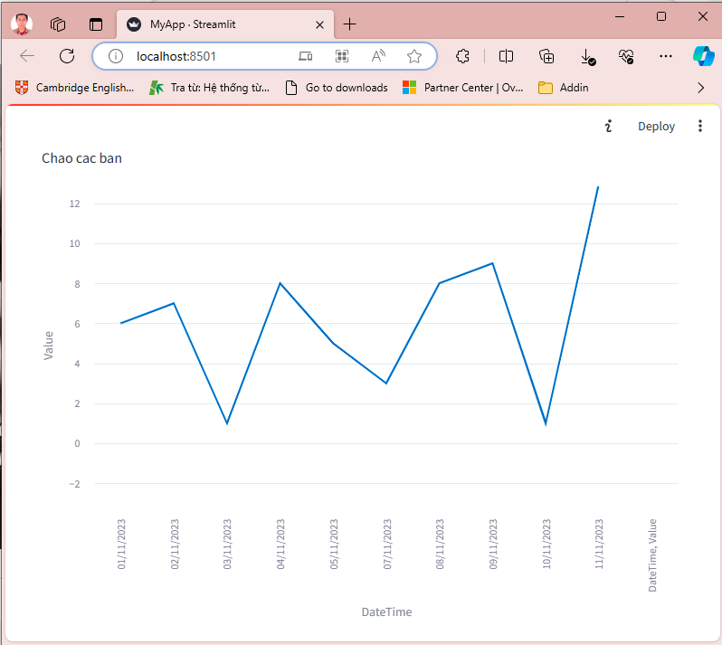

# HƯỚNG DẪN

```shell
python -m streamlit run ./MyApp.py
   You can now view your Streamlit app in your browser.

   Local URL: http://localhost:8501
   Network URL: http://192.168.4.111:8501__
```

Streamlit sẽ tự tạo website hiển thị kết quả như sau:
